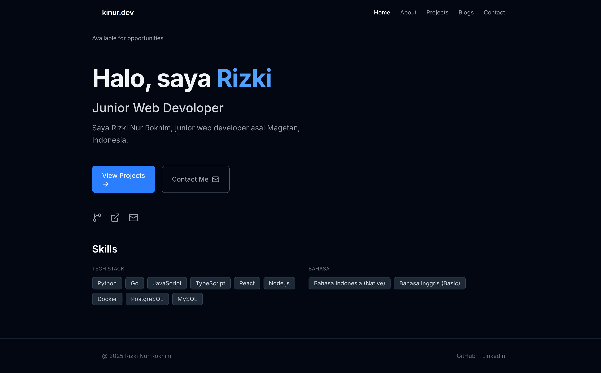
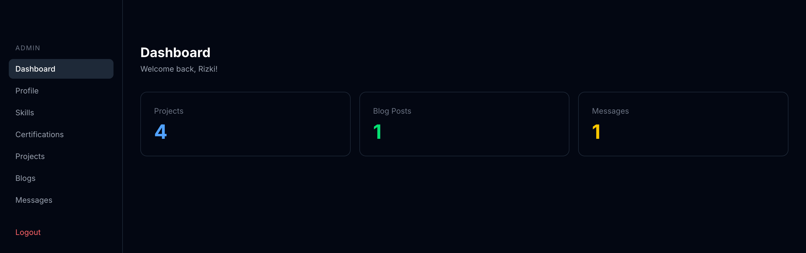

# Portfolio — kinur.my.id

Personal portfolio website full-stack dengan Next.js (frontend) dan Golang (backend), dilengkapi admin panel untuk mengelola konten secara dinamis.

🔗 **Live**: [kinur.my.id](https://kinur.my.id)

## Tech Stack

**Frontend**

- Next.js 14 (App Router) + TypeScript
- Tailwind CSS v4
- Framer Motion

**Backend**

- Golang + Gin
- Bun ORM + PostgreSQL
- JWT Authentication

**Infrastructure**

- Frontend: Vercel
- Backend: VPS (Ubuntu) + Nginx + Certbot
- DNS: Cloudflare
- CI/CD: GitHub Actions

## Architecture# Portfolio — kinur.my.id

Personal portfolio website full-stack dengan Next.js (frontend) dan Golang (backend), dilengkapi admin panel untuk mengelola konten secara dinamis.

🔗 **Live**: [kinur.my.id](https://kinur.my.id)

## Tech Stack

**Frontend**

- Next.js 14 (App Router) + TypeScript
- Tailwind CSS v4
- Framer Motion

**Backend**

- Golang + Gin
- Bun ORM + PostgreSQL
- JWT Authentication

**Infrastructure**

- Frontend: Vercel
- Backend: VPS (Ubuntu) + Nginx + Certbot
- DNS: Cloudflare
- CI/CD: GitHub Actions

## Architecture

┌─────────────┐ ┌──────────────┐ ┌─────────────┐
│ Next.js │ ──────▶ │ Golang API │ ──────▶ │ PostgreSQL │
│ (Vercel) │ HTTPS │ (VPS+Nginx) │ │ (VPS) │
└─────────────┘ └──────────────┘ └─────────────┘

## Features

- 🏠 Dynamic Home, About, Projects, Blog, Contact pages
- 🔐 Admin panel dengan JWT auth (cookie-based)
- ✏️ Full CRUD: Projects, Blog Posts, Skills, Certifications, Profile
- 📩 Contact form tersimpan ke database
- 🚀 Auto-deploy: Vercel (frontend) + GitHub Actions (backend)

## Project Structure

.
├── frontend/ # Next.js app
│ ├── app/ # Pages (App Router)
│ ├── components/ # Shared components
│ └── lib/ # API client
├── backend/ # Golang API
│ ├── handlers/ # Route handlers
│ ├── models/ # Bun ORM models
│ ├── routes/ # Route definitions
│ └── middleware/ # JWT auth middleware
└── .github/workflows/ # CI/CD pipelines

## Local Development

**Backend**

```bash
cd backend
cp .env.example .env
go run main.go
```

**Frontend**

```bash
cd frontend
cp .env.example .env.local
npm install
npm run dev
```

## Screenshots

| Home                     | Admin Dashboard            |
| ------------------------ | -------------------------- |
|  |  |

## Author

**Rizki Nur Rokhim**
[GitHub](https://github.com/rzkinr) · [LinkedIn](https://linkedin.com/in/rizkinr)
